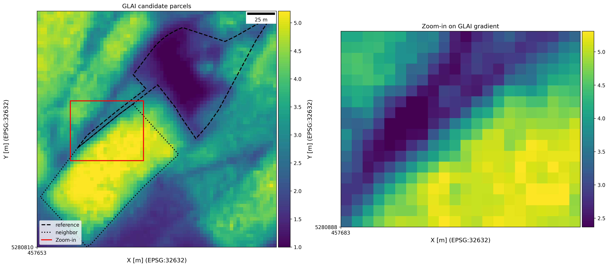

# Field Boundaries

This repository contains sample code to generate Areas of Interest (AOI) from Green Leaf Area Index (GLAI) rasters generated using the [LAI4SR](https://github.com/lukasValentin/lai4sr) (Leaf Area Index for Super Resolution) project used in the [master thesis](https://github.com/neffjulian/remote_sensing) of @neffjulian. These AOIs can be used to validate the super-resolved GLAI product (from Sentinel-2).

It uses the official field parcel boundaries provided by [GeoDienste.ch](https://www.geodienste.ch/services/lwb_nutzungsflaechen), preposssed in the [LAI4SR](https://github.com/lukasValentin/lai4sr) project containing the median GLAI per field parcel geometry. In the [image](img/input_data.png) below the original satellite-derived GLAI is shown on the left (in this case from Planet SuperDove 4band GLAI) and the obtained median GLAI value per parcel on the right.

Based on the median GLAI value per parcel, parcel pairs are selected that show a large gradient in median GLAI. The [script](src/field_bounaries.py) performs a loop over all parcel geometries available:

1. a spatial buffer of 10 m is generated around the current parcel geometry
2. its neighboring parcels are identified by selecting all parcels that intersect the buffered parcel geometry
3. the maximum gradient among all neighbors is recorded

After that loop, the parcels with a maximum GLAI gradient to their neighbors in the upper 5% quantile of gradient values are used for further analysis. This way we aim to obtain pairs of parcels with a maximum contrast in GLAI (e.g., a parcel with dense, green vegetation next to a parcel with bare-soil)  that we can exploit to judge the quality of the super-resolution.

For these remaining parcels, the spatial intersection between the buffered parcel and its identified neighbor with large GLAI gradient is calculated in a second for-loop. We construct a rectangular bounding box around the intersectiona area and use this bounding box to clip the GLAI raster to this AOI, where the GLAI contrast is large.

Some examples are shown below:

The full set of AOIs generated from the sample [data](data) can be found [here](data/output) including a png and GeoTiff file per AOI.

## Validation Strategy

If the AOIs are generated for the Planet SuperDove (GLAI) and the super-resolved Sentinel-2 imagery, we can judge based on the representation of the gradients how well the super-resolution worked at the field boundaries.

